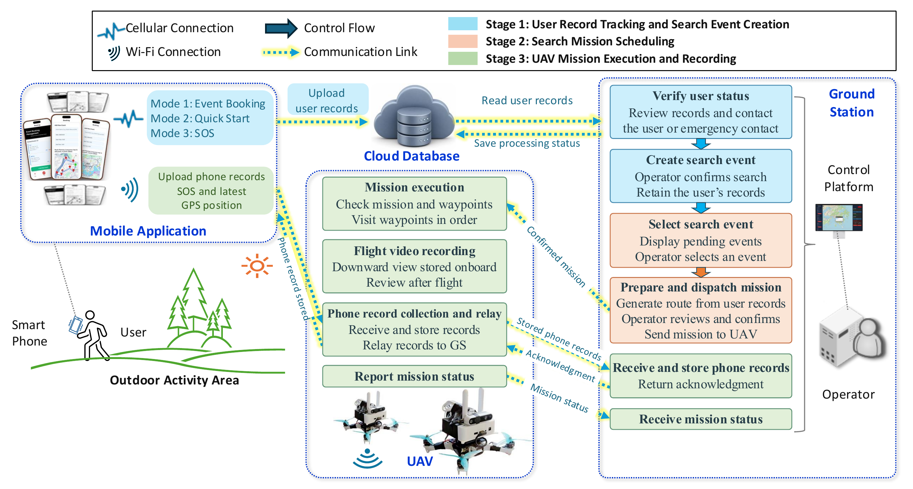
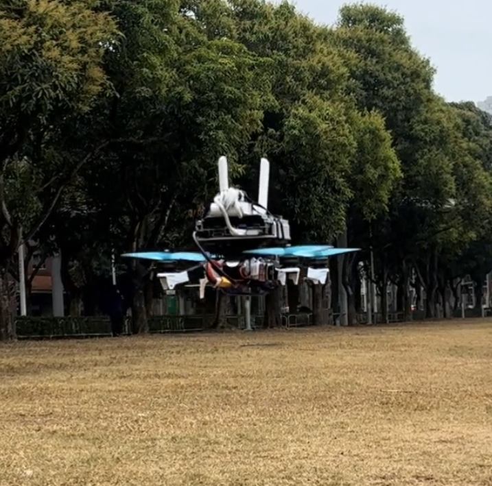

<p align="center">
  <a href="code/mobile_application/README.md">Mobile application</a> ·
  <a href="code/ground_station/README.md">Ground station</a> ·
  <a href="code/search_uav/README.md">Search UAV</a> ·
  <a href="simulation/README.md">Simulation</a> ·
  <a href="docs/Technical_Guide.md">Technical guide</a>
</p>

# Mountain Search UAV

A research system that connects hikers’ mobile records with UAV search missions confirmed by an operator. An Android application records planned trips, GPS history and SOS requests; the Windows ground station supports contact verification and route review; the onboard software executes the accepted mission and returns collected records.

This repository accompanies *A User-Triggered UAV Dispatching System for Precise and Fast Mountain Search Missions*. It includes the three software components, MATLAB terrain simulation and existing outdoor test footage.

**Technology:** Android / React Native + Kotlin · Windows / Python + CustomTkinter · ROS Noetic + C++ · Wi-Fi · MATLAB

## Explore the components

| Component | What it does | Illustrated guide |
| --- | --- | --- |
| **Mobile application** | Creates trip records, persists timestamped GPS and submits SOS requests | [Screens, recording architecture and Android setup](code/mobile_application/README.md) |
| **Windows ground station** | Verifies notices, creates search events, reviews routes and coordinates dispatch | [Interface, system architecture and operator workflow](code/ground_station/README.md) |
| **Search UAV** | Receives missions, executes ordered targets, records video and relays collected phone records | [Airframe, onboard architecture and mission lifecycle](code/search_uav/README.md) |
| **Terrain simulation** | Compares three complete missions over a shared terrain scenario | [Figures, parameters and reproduction](simulation/README.md) |

## System Architecture



The figure is reproduced directly from the paper. The operator contacts the hiker or emergency contact and **explicitly confirms a search** before a dispatchable event is created. The selected event’s route is then prepared, reviewed and dispatched. UAV admission confirms the transition into execution. [Open the original figure at full size](docs/assets/diagrams/system-architecture.png).

## Three service modes

| Mode | Record supplied by the phone | Notice for verification | Route after search confirmation |
| --- | --- | --- | --- |
| **01 · Event Booking** | Planned route and departure time; end time estimated at 4 km/h | Trip exceeds its estimated end time | Planned waypoint order |
| **02 · Quick Start** | GPS positions with their original sample timestamps | Latest valid sample reaches the configured update timeout | Complete position history in time order |
| **03 · SOS** | Request time and current position | A pending SOS request arrives | Expanding square around the SOS position |

All modes begin with the same event priority and use the same operator confirmation process. Fresh samples at an unchanged position do not satisfy the current update-timeout rule. The separate emergency-call button opens the phone dialer; SOS uploads enter this system’s database and ground station.

## See the system

<table>
  <tr>
    <td align="center" width="34%"><a href="code/search_uav/README.md"></a><br><strong>Physical prototype</strong><br>Existing outdoor test material</td>
    <td align="center" width="66%"><a href="simulation/README.md"></a><br><strong>Shared terrain scenario</strong><br>Saved MATLAB trajectories</td>
  </tr>
</table>

| Watch | Focus |
| --- | --- |
| [SOS search pattern and end-to-end pipeline](https://www.youtube.com/watch?v=oQvX7AQdywA) | System demonstration and route preparation |
| [Onboard console and failsafe interface](https://www.youtube.com/watch?v=A7RMnk3LN9k) | Onboard interface and controls |
| [Real-world test footage](https://www.youtube.com/watch?v=Zf9cXaNFMGM) | Existing outdoor flight material |

The [video index](docs/Demo_Videos.md) links each demonstration to its supporting footage and simulation materials.

## Start here

| Goal | Entry point |
| --- | --- |
| Read the complete setup and behavior guide | [Markdown](docs/Technical_Guide.md) · [PDF](docs/Technical_Guide.pdf) · [Word](docs/Technical_Guide.docx) |
| Install and use a component | [Android](code/mobile_application/README.md#getting-started) · [Ground station](code/ground_station/README.md#getting-started) · [UAV](code/search_uav/README.md#getting-started) |
| Find the implementation of each system function | [Implementation index](docs/Technical_Guide.md#8-implementation-index) |
| Build the onboard ROS package | [UAV setup](code/search_uav/README.md#getting-started) |
| Redraw or recompute the terrain study | [Simulation guide](simulation/README.md#reproduce-the-study) |

## Repository map

Start with the three component guides or the simulation. [Documentation](docs/README.md) collects the manuals, architecture diagrams and original images.

```text
code/
  mobile_application/       Android application
  ground_station/           Windows operator application
  search_uav/               Onboard UAV software
simulation/                 MATLAB study and saved numerical outputs
docs/                       Setup manuals, figures and outdoor media
LICENSES/                   Component licenses and third-party notices
```

## Deployment and evidence

The mobile source supports **Android**. Configure the shared database, ground-station credentials and timeout thresholds, reachable communication service and onboard receiver before live operation. Set both ground-station thresholds in the deployment configuration template. The [technical guide](docs/Technical_Guide.md) explains these settings, and the [flight setup guide](docs/Flight_Environment_Setup.txt) pins the external flight workspace.

The simulation’s 80 m above-ground cruise setting belongs to the MATLAB study. It does not override the onboard launch configuration. Existing outdoor footage records the documented prototype observations.

Original photographs, video and manuscript screenshots are listed in the [image source index](docs/assets/README.md).

## Sources and licenses

Elevation data is the Mapzen / Tilezen Skadi N22E114 tile; routes and GPS history are synthetic simulation inputs. The walking-speed reference is Ordnance Survey’s *Map Reading* guide; see [Sources](docs/Sources.txt). [Component licenses and third-party notices](LICENSES/) retain their individual terms.
