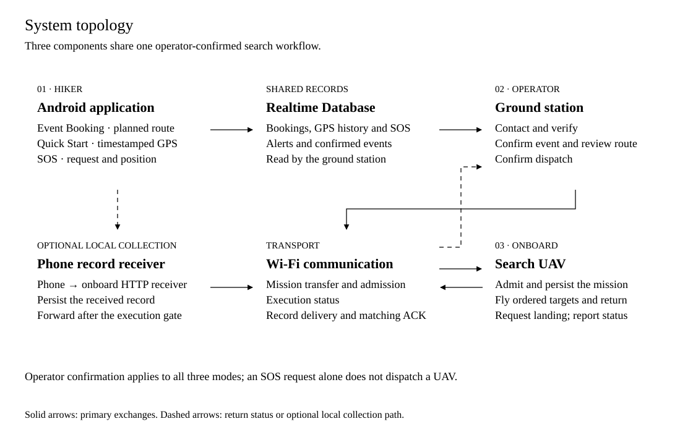

<p align="center">
  <a href="code/mobile_application/README.md">Mobile application</a> ·
  <a href="code/ground_station/README.md">Ground station</a> ·
  <a href="code/search_uav/README.md">Search UAV</a> ·
  <a href="simulation/README.md">Simulation</a> ·
  <a href="docs/Technical_Guide.md">Technical guide</a>
</p>

# Mountain Search UAV

A research system that connects hikers’ mobile records with UAV search missions confirmed by an operator. An Android application records planned trips, GPS history and SOS requests; the Windows ground station supports contact verification and route review; the onboard software executes the accepted mission and returns collected records.

This repository accompanies *A User-Triggered UAV Dispatching System for Precise and Fast Mountain Search Missions*. It includes the three software components, MATLAB terrain simulation, local verification records and existing outdoor test footage.

**Technology:** Android / React Native + Kotlin · Windows / Python + CustomTkinter · ROS Noetic + C++ · Wi-Fi · MATLAB

## Explore the components

| Component | What it does | Illustrated guide |
| --- | --- | --- |
| **Mobile application** | Creates trip records, persists timestamped GPS and submits SOS requests | [Screens, recording architecture and Android setup](code/mobile_application/README.md) |
| **Windows ground station** | Verifies notices, creates search events, reviews routes and coordinates dispatch | [Interface, system topology and operator workflow](code/ground_station/README.md) |
| **Search UAV** | Receives missions, executes ordered targets, records video and relays collected phone records | [Airframe, onboard architecture and mission lifecycle](code/search_uav/README.md) |
| **Terrain simulation** | Compares three complete missions over a shared terrain scenario | [Figures, parameters and reproduction](simulation/README.md) |

## System topology



The operator contacts the hiker or emergency contact and **explicitly confirms a search** before a dispatchable event is created. The selected event’s route is then prepared, reviewed and dispatched. UAV admission confirms the transition into execution. [Open the diagram at full size](docs/assets/diagrams/system-topology.svg).

## Three service modes

| Mode | Record supplied by the phone | Notice for verification | Route after search confirmation |
| --- | --- | --- | --- |
| **01 · Event Booking** | Planned route and departure time; end time estimated at 4 km/h | Trip exceeds its estimated end time | Planned waypoint order |
| **02 · Quick Start** | GPS positions with their original sample timestamps | Latest valid sample reaches the configured update timeout | Complete position history in time order |
| **03 · SOS** | Request time and current position | A pending SOS request arrives | Expanding square around the SOS position |

All modes begin with the same event priority and use the same operator confirmation process. Fresh samples at an unchanged position do not satisfy the current update-timeout rule. The separate emergency-call button opens the phone dialer; SOS uploads enter this system’s database and ground station.

## See the system

<table>
  <tr>
    <td align="center" width="34%"><a href="code/search_uav/README.md"></a><br><strong>Physical prototype</strong><br>Existing outdoor test material</td>
    <td align="center" width="66%"><a href="simulation/README.md"></a><br><strong>Shared terrain scenario</strong><br>Saved MATLAB trajectories</td>
  </tr>
</table>

| Watch | Focus |
| --- | --- |
| [SOS search pattern and end-to-end pipeline](https://www.youtube.com/watch?v=oQvX7AQdywA) | System demonstration and route preparation |
| [Onboard console and failsafe interface](https://www.youtube.com/watch?v=A7RMnk3LN9k) | Onboard interface and controls |
| [Real-world test footage](https://www.youtube.com/watch?v=Zf9cXaNFMGM) | Existing outdoor flight material |

The [video and test-material index](docs/Demo_Videos.md) links each demonstration to its supporting repository files. Current software checks, simulated trajectories and existing outdoor footage have separate evidence scopes.

## Start here

| Goal | Entry point |
| --- | --- |
| Read the complete setup and behavior guide | [Markdown](docs/Technical_Guide.md) · [PDF](docs/Technical_Guide.pdf) · [Word](docs/Technical_Guide.docx) |
| Install and use a component | [Android](code/mobile_application/README.md#getting-started) · [Ground station](code/ground_station/README.md#getting-started) · [UAV](code/search_uav/README.md#getting-started) |
| Find implementation and supporting tests | [Implementation and evidence index](docs/Technical_Guide.md#9-implementation-and-evidence-index) |
| Build the ROS package locally | [Local ROS verification](verification/tools/ros_local/README.md) |
| Redraw or recompute the terrain study | [Simulation guide](simulation/README.md#reproduce-the-study) |

## Local verification

Use Python 3.12 with Tk support, Node.js 24 and a C++14 compiler. From the repository root:

```sh
python3.12 -m venv .venv
source .venv/bin/activate
python -m pip install -r verification/requirements.txt
python verification/tools/prepare_local.py
cd code/mobile_application
npm ci
cd ../..
python verification/run.py --output local-results/verification-01
```

Choose a **new output directory** for every run. Read its `summary.json`, per-step logs and `simulation_checks.json`. The software checks use synthetic inputs and mocked service connections. The preparation script creates an ignored placeholder client configuration only if the local file is absent.

To exercise phone-record reception, return, persistence and acknowledgement with a temporary loopback-only Mosquitto broker:

```sh
python verification/integration/run_phone_uav_gs_bench.py --output local-results/phone-relay-01
```

The [30 September Android validation report](verification/reports/Android_Only_Validation_20260930.md) records the results of that dated software snapshot. Emulator, ROS, protocol-fault, relay, video and MATLAB results are listed separately. Running the commands above creates a new verification record for the current source.

The [1 October layout verification](verification/reports/layout_verification_20261001.json) passed 647 software tests, the native recording checks, 52 saved-simulation checks and the loopback record relay after the directory reorganization. The earlier [startup verification](verification/records/release_verification_20261001.json) separately records 100 concurrent database migrations and 100 transient-lock recovery runs.

## Repository map

Start with the three component guides or the simulation. [Documentation](docs/README.md) collects the manuals and images; [Verification](verification/README.md) explains the automated checks and saved evidence.

```text
code/
  mobile_application/       Android application
  ground_station/           Windows operator application
  search_uav/               Onboard UAV software
simulation/                 MATLAB study and saved numerical outputs
docs/                       Setup manuals, figures and outdoor media
verification/               Tests, validation tools and saved run records
LICENSES/                   Component licenses and third-party notices
```

The implementation baseline is `UAV-SEARCH-20260928`; Git history records later revisions. Application versions and protocol versions are recorded separately in [source metadata](verification/source_revision.json).

## Deployment and evidence

The mobile source supports **Android**. Configure the shared database, ground-station credentials and timeout thresholds, reachable communication service and onboard receiver before live operation. The configuration template leaves the two ground-station thresholds unset; the 1-second location threshold appears in tests. The [technical guide](docs/Technical_Guide.md) explains these settings, and the [flight setup guide](docs/Flight_Environment_Setup.txt) pins the external flight workspace.

The simulation’s 80 m above-ground cruise setting belongs to the MATLAB study. It does not override the onboard launch configuration. Existing outdoor footage supports the documented prototype observations; local software verification does not establish deployment of every current revision on a physical aircraft.

| Evidence | Read more |
| --- | --- |
| Current implementation and validation summary | [Android report](verification/reports/Android_Only_Validation_20260930.md) · [Structured results](verification/reports/Android_Only_Validation_20260930.json) |
| Manuscript correspondence | [Paper alignment](verification/reports/Paper_Alignment_20260930.md) · [Structured results](verification/reports/Paper_Alignment_Validation_20260930.json) |
| Earlier saved software runs | [30 September](verification/records/verification_20260930/summary.json) · [28 September](verification/records/verification_summary.json) |
| Local phone-record relay | [Saved relay materials](verification/records/phone_relay/20260928/) |
| Photos, video and documentation images | [Outdoor archive](docs/assets/outdoor/) · [Image source index](docs/assets/README.md) |

## Integrity and sources

Run `python verification/tools/check_archive.py` to check the packaged files against their manifest. Original input hashes and source commits remain in [source provenance](verification/records/source_provenance.json). New verification output belongs in a fresh results directory.

Elevation data is the Mapzen / Tilezen Skadi N22E114 tile; routes and GPS history are synthetic simulation inputs. The walking-speed reference is Ordnance Survey’s *Map Reading* guide; see [Sources](docs/Sources.txt). [Component licenses and third-party notices](LICENSES/) retain their individual terms.
