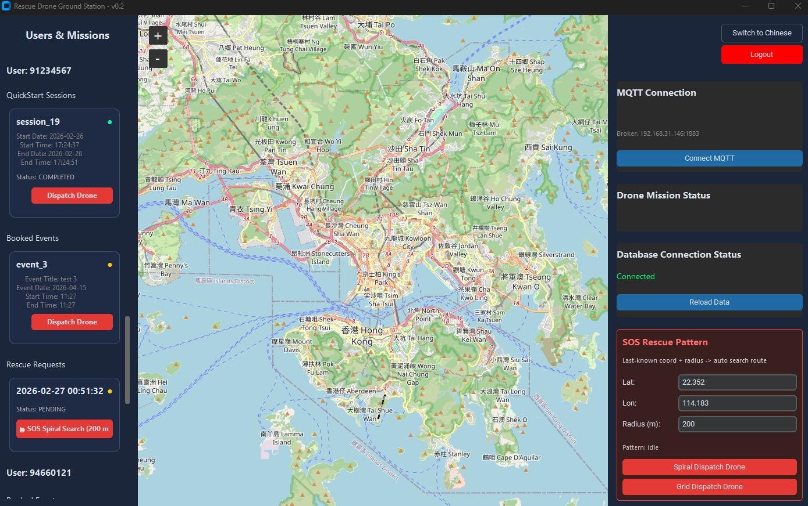
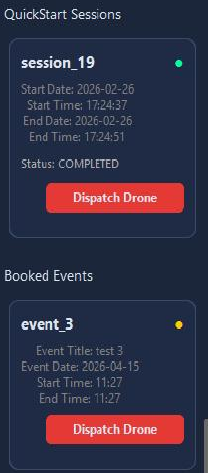
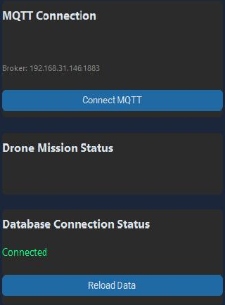
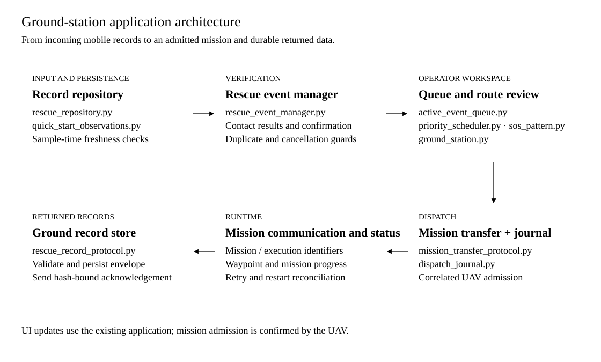

# Ground Station

**The Windows operator application for Mountain Search UAV.** Review notices from hikers, record contact outcomes, confirm a search, inspect its route and dispatch it to the UAV. Execution status and returned phone records remain visible in the same desktop application.

[System overview](../../README.md) · [Mobile application](../mobile_application/README.md) · [Search UAV](../search_uav/README.md) · [Technical guide](../../docs/Technical_Guide.md)

**Platform:** Windows  |  **Stack:** Python · CustomTkinter 5.2.2 · tkintermapview 1.29 · Firebase Admin 7.4.0

[Interface](#interface) · [Topology](#system-topology) · [Workflow](#operator-workflow) · [Architecture](#application-architecture) · [Setup](#getting-started)

## Interface



**This is the Windows ground-station screenshot used in the paper.** The original window and version label are retained. Its left panel lists users and mission records, the centre shows the map, and the right panel shows UAV communication, UAV mission status, database connection and SOS route controls. [Open the original screenshot](../../docs/assets/screenshots/ground-station-windows.jpg).

| Interface area | What the operator sees |
| --- | --- |
| Users and missions | Quick Start sessions, booked events and SOS records |
| Map and route | Geographic positions, selected points and prepared mission paths |
| UAV communication | Broker endpoint, connection state and connection control |
| Drone mission status | Status reported by the onboard mission software |
| Database connection | Server connection state and record refresh |
| SOS route controls | Search centre, extent and route preparation controls |

<details>
<summary><strong>Enlarge mission records and server connection panels</strong></summary>

<table>
  <tr>
    <td align="center" width="40%"><br><strong>Mission records</strong></td>
    <td align="center" width="60%"><br><strong>Connections and status</strong></td>
  </tr>
</table>

These details are cropped directly from the same manuscript figure.

</details>

The workflow below explains the current contact-verification and dispatch sequence. [Image source](../../docs/assets/README.md#ground-station).

## System topology


The ground station reads mobile records from the shared database and exchanges missions, status and collected records with the UAV over the deployment network. The operator retains the decision to confirm a search and dispatch its reviewed route.

## Operator workflow


1. **Inspect a notice.** An overdue booking, GPS sample timeout or pending SOS enters verification.
2. **Contact and verify.** Record the user’s response and, when necessary, emergency-contact outcomes. A safe outcome closes the alert.
3. **Confirm the search.** Explicit confirmation creates a search event. Repeated scans or confirmation do not create duplicate events.
4. **Select and prepare.** Select the event, generate its route and inspect the mission settings. Relevant record changes require preparation again.
5. **Confirm dispatch.** Send the prepared mission and wait for correlated UAV admission before committing execution.
6. **Follow execution and data return.** Observe mission progress, store returned phone records and acknowledge matching identifiers and hashes.

All modes start with the same priority and waiting-time rule. An SOS request is subject to the same verification gate. Cancelled or stale records cannot bypass the confirmation checks.

### Route preparation

| Record mode | Flight route |
| --- | --- |
| Event Booking | User-selected planned points, in their original order |
| Quick Start | Full GPS history ordered by sample time, including repeated coordinates at different times |
| SOS | Expanding square around the recorded SOS location |

The update-timeout rule uses **sample time**, preserving the distinction between when a position was measured and when it was uploaded. A fresh stationary sample is still a fresh update.

## Application architecture



| Responsibility | Implementation |
| --- | --- |
| Desktop interface and route preparation | [ground_station.py](ground_station.py) |
| Contact verification and event creation | [rescue_event_manager.py](rescue_event_manager.py) |
| Record persistence and queue management | [rescue_repository.py](rescue_repository.py) · [active_event_queue.py](active_event_queue.py) |
| Waiting-time priority and GPS freshness | [priority_scheduler.py](priority_scheduler.py) · [quick_start_freshness.py](quick_start_freshness.py) |
| SOS geometry | [sos_pattern.py](sos_pattern.py) |
| Durable mission transfer and admission | [mission_transfer_protocol.py](mission_transfer_protocol.py) · [dispatch_journal.py](dispatch_journal.py) |
| Returned-record validation and storage | [rescue_record_protocol.py](rescue_record_protocol.py) |

### Mission communication

The ground station sends the reviewed mission and receives matching acceptance, execution status and returned records. It also supports explicit target retry and mission abort. The dispatch journal preserves the mission and execution identifiers across retries and restarts. Message transmission alone does not confirm UAV acceptance.

## Getting started

Run the operator application on **Windows**. From the repository root in PowerShell, prepare Python 3.12 and this component’s dependencies:

```powershell
py -3.12 -m venv .venv
.\.venv\Scripts\Activate.ps1
python -m pip install -r code\ground_station\requirements.txt
```

For normal operation, copy [runtime.env.example](runtime.env.example) to `runtime.env` and fill the deployment values:

| Setting | Purpose |
| --- | --- |
| `GS_FIREBASE_DATABASE_URL` | Shared database URL |
| `GS_FIREBASE_CREDENTIALS` | Local service-account path |
| `GS_T_LOCATION_UPDATE_SECONDS` | Positive GPS update timeout |
| `GS_T_WAIT_SECONDS` | Positive waiting-time priority threshold |
| `GS_EVENT_TIMEZONE` | Legacy booking timezone; template uses `Asia/Hong_Kong` |
| `GS_STATE_DIR` | Durable dispatch state directory |
| Communication endpoint | Shared address and port in the runtime template |

Both time thresholds are unset in the template. Save the completed file as `code/ground_station/runtime.env`, then export its values into the PowerShell process before launch:

```powershell
Get-Content code\ground_station\runtime.env | ForEach-Object {
    if ($_ -match '^\s*([^#=\s]+)=(.*)$') {
        [Environment]::SetEnvironmentVariable($matches[1], $matches[2].Trim(), 'Process')
    }
}
python code\deployment_preflight.py
Set-Location code\ground_station
python ground_station.py
```

The preflight checks configuration consistency locally. For Windows executable packaging, use the existing [build script](build_windows_release.ps1) with [requirements-build.txt](requirements-build.txt). It runs the component tests, builds the executable and writes its checksum and build information. See the [technical guide](../../docs/Technical_Guide.md#4--ground-station-verification-and-dispatch) for deployment settings.

## Verification and recorded operation

The saved [30 September report](../../docs/Android_Only_Validation_20260930.md#verification-results) records the ground-station tests for that dated snapshot, with separate cross-component and protocol-fault checks. Coverage includes contact confirmation, cancellation, sample freshness, complete-route ordering, mission admission, retries and restart reconciliation.

Use the [repository verification command](../../README.md#local-verification) for a new software run. The [phone-record relay bench](../integration_tests/run_phone_uav_gs_bench.py) exercises real loopback record return with synthetic records. Watch the [system pipeline demonstration](https://www.youtube.com/watch?v=oQvX7AQdywA) and consult the [video index](../../docs/Demo_Videos.md) for its evidence context.

[Next: onboard execution and record delivery →](../search_uav/README.md)
