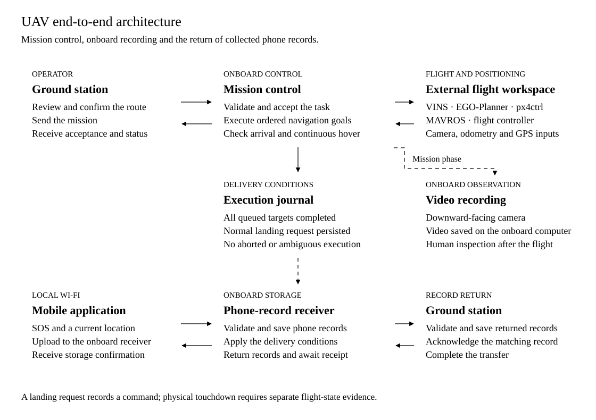
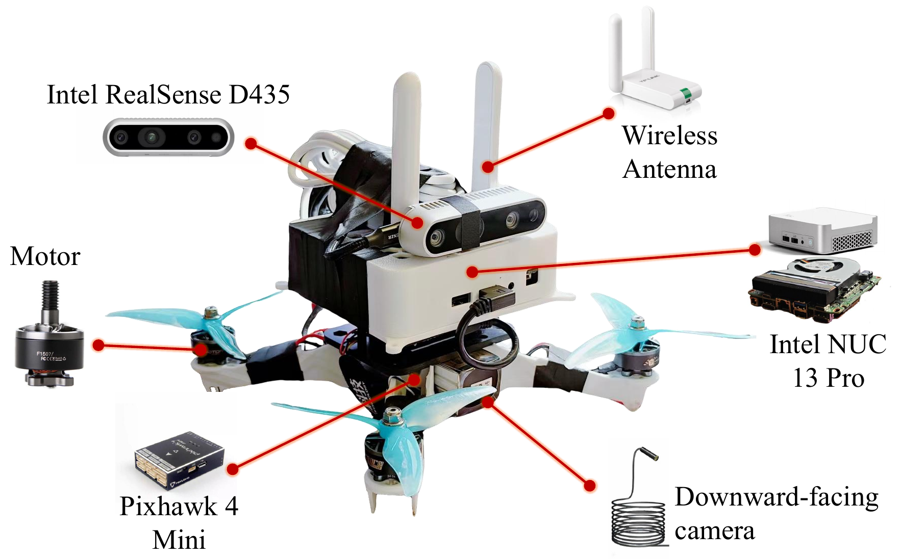

# Search UAV

**The onboard mission and data-collection component of Mountain Search UAV.** Receive an operator-confirmed mission, execute its ordered targets, return to launch, request landing and relay eligible phone records to the ground station. Onboard video supports human observation and post-flight review.

[System overview](../../README.md) · [Mobile application](../mobile_application/README.md) · [Ground station](../ground_station/README.md) · [Simulation](../../simulation/README.md)

**Stack:** Ubuntu 20.04 · ROS Noetic / catkin · C++ + Python · Wi-Fi · OpenCV · CustomTkinter

[Prototype](#prototype) · [Architecture](#end-to-end-architecture) · [Lifecycle](#mission-lifecycle) · [Record delivery](#phone-record-delivery) · [Setup](#getting-started)

## Prototype

<p align="center"></p>

The photographed airframe comes from the existing outdoor test archive. The documented prototype combines an onboard computer, flight controller, depth camera and separate downward-facing recording camera. [Full-size photograph](../../docs/assets/outdoor/airframe.jpg) · [Outdoor footage](../../docs/assets/outdoor/outdoor_flight.mp4).

| Hardware | Role |
| --- | --- |
| Intel NUC 13 Pro | Onboard computation and mission software |
| Pixhawk 4 Mini | Flight controller |
| Intel RealSense D435 | Depth-camera input for the onboard flight stack |
| Downward-facing recording camera | Video saved on the onboard computer |
| Wi-Fi | Ground-station communication and local phone-record reception |
| RadioLink AT9S Pro + R12DSM | Manual-control link; SBus to the controller |

The hardware description follows the [flight environment guide](../../docs/Flight_Environment_Setup.txt). Existing footage and local software checks are documented separately.

## End-to-end architecture



The Python bridge validates and persists the mission. The execution state machine and C++ commander coordinate sequential targets with fresh navigation feedback. The pinned external workspace supplies the sensing, estimation, planning and flight-control modules. Status flows back to the ground station with mission and execution identifiers.

The HTTP receiver and video recorder run alongside mission execution. Collected phone records remain durable onboard until the execution journal permits forwarding. [Open the architecture at full size](../../docs/assets/diagrams/uav-architecture.svg).

## Mission lifecycle


| Stage | Behavior |
| --- | --- |
| Admit | Validate the task, persist its identity and construct the target queue |
| Navigate | Obtain target acceptance and monitor horizontal and vertical arrival |
| Hold | Require fresh, valid position feedback continuously for the configured hover interval |
| Advance / return | Visit every remaining target and the appended return-to-launch point when enabled |
| Request landing | Publish and persist the normal landing request after queue completion |
| Deliver records | Forward eligible collected records and reconcile ground acknowledgement |

`LAND_REQUESTED` records a command request. Physical touchdown needs separate flight-state evidence. Timeout, rejected targets, stale feedback and restart recovery have explicit handling; an aborted or ambiguous execution cannot authorize normal record forwarding.

The default bridge launch altitude is **5 m**. The **80 m above-ground** cruise used by the [MATLAB study](../../simulation/README.md) is a separate simulation setting.

## Phone-record delivery


A phone submits a record through the onboard HTTP interface. The receiver validates and saves it with stable identifiers and content hashes. Forwarding requires completion of the matching execution’s full target queue and a persisted normal landing request. The ground station validates the envelope, stores the record and sends a matching acknowledgement. Only that acknowledgement completes the transfer.

### Onboard interface and hardware



This hardware figure is reproduced from the paper. The actual onboard console is [drone_console.py](drone_system/launcher/drone_console.py); it shows stack status, mission information, communication settings and video-recording controls. The [recorded onboard console and failsafe video](https://www.youtube.com/watch?v=A7RMnk3LN9k) shows that interface. [Open the hardware figure](../../docs/assets/screenshots/uav-hardware-paper.png).

## Getting started

The onboard environment uses Ubuntu 20.04, ROS Noetic and two catkin workspaces. Follow the [flight environment setup](../../docs/Flight_Environment_Setup.txt) for the exact external dependency commit, required placement, calibration and receiver settings. The pinned flight workspace is an external dependency; this directory contains the mission bridge and onboard application layer.

For the documented onboard layout, build in order:

```sh
source /opt/ros/noetic/setup.bash
cd /home/mike/Fast-Drone-250
catkin_make
source devel/setup.bash
cd /home/mike/catkin_ws
catkin_make
source devel/setup.bash
```

Once the flight-stack prerequisites and deployment configuration are ready, the mission bridge entry point is:

```sh
roslaunch rescue_bridge rescue_bridge.launch mqtt_broker:=BROKER_HOST
```

`BROKER_HOST` must be reachable by the UAV and ground station. Configure local installation paths, serial ports, sensor calibration, camera index and broker settings for the actual aircraft. Phone-record receiver settings are in [rescue_receiver.env.example](drone_system/config/rescue_receiver.env.example); the [receiver launcher](drone_system/bin/start_rescue_receiver.sh) exports the local configuration file.

## Source map

| Area | Entry point |
| --- | --- |
| Mission reception and status exchange | [Mission communication](catkin_ws/src/rescue_bridge/src/mqtt_bridge.py) |
| Persistent execution state | [execution_state.py](catkin_ws/src/rescue_bridge/src/execution_state.py) |
| Target navigation and feedback | [mission_commander.cpp](catkin_ws/src/rescue_bridge/src/mission_commander.cpp) |
| ROS messages and launch settings | [msg/](catkin_ws/src/rescue_bridge/msg/) · [launch/](catkin_ws/src/rescue_bridge/launch/) |
| HTTP reception and forwarding | [phone_sos_receiver.py](drone_system/receiver/phone_sos_receiver.py) |
| Capture storage and delivery gate | [capture_store_v2.py](drone_system/receiver/capture_store_v2.py) · [delivery_eligibility.py](drone_system/receiver/delivery_eligibility.py) |
| Onboard interface and video | [drone_console.py](drone_system/launcher/drone_console.py) · [cam_recorder.py](drone_system/launcher/cam_recorder.py) |
| Installation-specific launch commands | [drone_system/bin/](drone_system/bin/) |

## Verification and test material

The saved [30 September validation report](../../verification/reports/Android_Only_Validation_20260930.md) records 55 receiver tests, 69 mission-bridge tests and 22 recorder/console tests. Additional execution invariants, relay checks and ROS runtime scenarios are listed separately.

The [local ROS bench](../../verification/tools/ros_local/README.md) builds and runs the actual bridge and commander with synthetic GPS and odometry in a local container. Its saved run passed eight scenarios and 57 assertions. The [loopback relay bench](../../verification/integration/run_phone_uav_gs_bench.py) links receipt, persisted completion, forwarding, ground storage and acknowledgement.

[Real-world test video](https://www.youtube.com/watch?v=Zf9cXaNFMGM) · [Archived outdoor materials](../../docs/assets/outdoor/) · [Component license](LICENSE)
