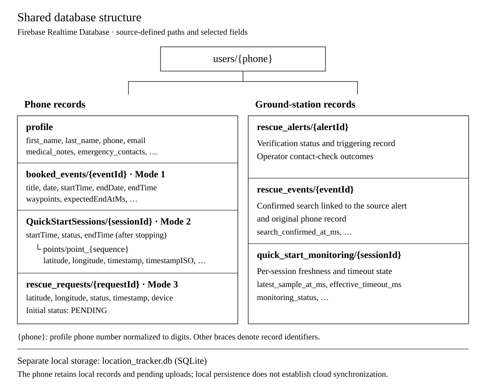

# Mobile Application

**The hiker’s entry point to the User-Triggered UAV Dispatching System.** Plan a trip, record timestamped GPS positions or submit an SOS request. The Android application keeps records locally and shows their synchronization state while the ground station handles operator verification.

[System overview](../../README.md) · [Ground station](../ground_station/README.md) · [Search UAV](../search_uav/README.md) · [Technical guide](../../docs/Technical_Guide.md)

**Stack:** React Native 0.80.2 · React 19.1 · TypeScript 5.0.4 · Kotlin · SQLite · Realtime Database

[Interface](#interface) · [Service modes](#service-modes) · [Architecture](#application-architecture) · [Setup](#getting-started)

## Interface


The three service screens are reproduced from the paper’s existing mobile-interface figure. They show route booking, recorded GPS positions and the SOS interface. The original screenshot labels are preserved. Current behavior and operator verification are described below. [Open the figure at full size](../../docs/assets/screenshots/mobile-paper.png).

## Service modes

| Mode | User action | What the system retains |
| --- | --- | --- |
| **Event Booking** | Name the trip, choose departure time and add ordered map points | Planned route, horizontal route distance and estimated end timestamp |
| **Quick Start** | Start a GPS recording; stop it at the end of the trip | Original sample time, session identity, point sequence and durable upload operations |
| **SOS** | Submit the current location with a help request | A locally persisted request with its pending or confirmed synchronization state |

Booking estimates use `ceil(route_distance_m / 4000 × 60)` minutes. Editing the route or departure time recalculates the full end timestamp. All three modes produce information for **ground-station verification**; the operator confirms a search and reviews the flight route. The separate emergency-call button opens the phone dialer.

## Application architecture


**Recording continues independently of the Quick Start page.** Android’s location foreground service validates samples and writes the sample and pending operation in one SQLite transaction. The upload worker retries saved operations separately. Navigating away removes screen polling while recording remains owned by the native service.

The requested sampling interval is five seconds. Stopping persists the local end state immediately; cloud completion is tracked separately. Force-stop interrupts acquisition, and reopening offers an explicit Resume action. No positions are fabricated for the interruption. The map preview is capped at 1,000 points; accepted history remains in storage and uploads in full. See [Persistent Android recording](../../docs/Android_Recording.md) for lifecycle and queue details.

### Where this component sits

`Phone records → shared database → operator verification → reviewed UAV mission`

The phone can also submit records to the UAV’s local HTTP receiver. Onboard persistence and later ground-station acknowledgement belong to the [UAV record-delivery workflow](../search_uav/README.md#phone-record-delivery). A local save, a completed upload and a confirmed search are separate states.

## Screen map

| Screen | Purpose | Implementation |
| --- | --- | --- |
| Map | Location view and access to rescue services | [MapPage.tsx](src/pages/MapPage.tsx) |
| Event Booking | Trip details, ordered route and estimated end time | [EventBookingPage.tsx](src/pages/EventBookingPage.tsx) |
| Quick Start | Start, resume, stop and inspect persistent GPS recording | [AndroidQuickStartPage.tsx](src/pages/AndroidQuickStartPage.tsx) |
| SOS | Help request, local UAV transfer and separate call action | [SosPage.tsx](src/pages/SosPage.tsx) |
| Profile | Hiker and emergency-contact information | [ProfilePage.tsx](src/pages/ProfilePage.tsx) |
| Settings | Language, profile access and local UAV connection settings | [SettingPage.tsx](src/pages/SettingPage.tsx) |

The interface includes English and Chinese translations.

## Project structure

| Location | Contents |
| --- | --- |
| [src/](src/) | Application entry component, pages, services and translations |
| [android/](android/) | Native Android application and recording service |

The root `package.json` and `package-lock.json` define and lock npm dependencies. `app.json` identifies the registered application, and `tsconfig.json` supplies the TypeScript configuration. These files stay at the application root for the standard toolchain commands.

## Database structure



The diagram shows source-defined paths and selected fields, rather than a capture of the operational database. Braces denote record identifiers.

The shared Firebase Realtime Database groups records under `users/{phone}`, where `{phone}` is the profile phone number with non-digit characters removed. The current application and ground station use these paths:

```text
users/{phone}/
  profile
  booked_events/{eventId}
  QuickStartSessions/{sessionId}
    points/point_{sequence}
  rescue_requests/{requestId}
  rescue_alerts/{alertId}
  rescue_events/{eventId}
  quick_start_monitoring/{sessionId}
```

| Record | Main fields and purpose |
| --- | --- |
| `profile` | `first_name`, `last_name`, `gender`, `phone`, `email`, `medical_notes`, `emergency_contacts` and `updated_at`. The current writer stores `emergency_contacts` as a JSON-encoded array of contact names and phone numbers. |
| `booked_events` — Mode 1 | `title`, `date`, `startTime`, `endDate`, `endTime`, ordered `waypoints` and `createdAt`. New bookings also store `expectedEndAtMs`, `routeDistanceM`, `estimatedDurationMinutes`, `walkingSpeedKmh` and `estimationMethod` for the route-based end-time estimate. |
| `QuickStartSessions` — Mode 2 | `startTime`, `status`, `points` and, after stopping, `endTime`. Each point records `latitude`, `longitude`, the original sample `timestamp` in Unix milliseconds and `timestampISO`; available sensor measurements include `accuracy`, `altitude`, `speed` and `heading`. Point keys retain their sequence. |
| `rescue_requests` — Mode 3 | `latitude`, `longitude`, `status`, `timestamp` and `device`. The phone initially writes `status: PENDING`; the timestamp identifies the request time. |

The Android queue adds `_client_revision` and `_deleted` to booking and SOS records. Deleting a booking retains a versioned deletion record so that a delayed upload cannot restore it.

The ground station maintains three additional groups. `rescue_alerts` stores verification status, the triggering record and contact-check outcomes. `rescue_events` links a confirmed search to its source alert and original phone record, including `search_confirmed_at_ms`. `quick_start_monitoring` retains per-session freshness and timeout state, including `latest_sample_at_ms`, `effective_timeout_ms` and `monitoring_status`. These groups keep incoming phone records separate from operator-confirmed search events.

The phone's local SQLite database, `location_tracker.db`, is separate from the shared cloud database. It retains local records and pending upload operations; a local save does not establish cloud synchronization. See [persistent Android recording](../../docs/Android_Recording.md).

This repository documents the structure and provides configuration templates. The operational database and its user records are not included. Configure your own database and use the same database URL in the mobile application and ground station.

Sources: [profile](src/pages/ProfilePage.tsx), [booking fields](src/services/eventBookingRecord.ts), [native storage and upload paths](android/app/src/main/java/com/fypproject/tracking/TrackingStore.kt), [SOS record](src/pages/SosPage.tsx), and [ground-station event handling](../ground_station/src/rescue_event_manager.py).

## Getting started

Use Node.js 24 for the documented local workflow, plus the Android SDK and JDK required by the project’s Gradle configuration. Commands below start in this directory.

```sh
npm ci
```

For a device build, copy [firebaseConfig.example.ts](src/services/db/firebaseConfig.example.ts) to `src/services/db/firebaseConfig.ts`. Replace its `EXTERNAL_*` placeholders with the client configuration from your own Firebase project's settings. Copy the Realtime Database URL from that project's console; it must match the ground station's `GS_FIREBASE_DATABASE_URL`. Also supply the native Android service file and map credentials.

The local `firebaseConfig.ts` and native `google-services.json` files are ignored by Git. Keep service-account private keys and GitHub access tokens out of the mobile application. The ground station loads its service-account file through `GS_FIREBASE_CREDENTIALS`; keep that file outside the repository. Then start Metro and the Android build in separate terminals:

```sh
npm start
```

```sh
npm run android
```

The source and build targets in this repository support Android. See [persistent Android recording](../../docs/Android_Recording.md) for the location-service lifecycle and synchronization behavior.

## Source map

| Area | Files |
| --- | --- |
| Screen components and translations | [pages/](src/pages/) · [translations/](src/translations/) |
| Route timing and record shape | [eventBookingRecord.ts](src/services/eventBookingRecord.ts) |
| JavaScript/native recording boundary | [persistentTracking.ts](src/services/persistentTracking.ts) |
| Sampling, storage and synchronization | [Android tracking package](android/app/src/main/java/com/fypproject/tracking/) |
| Local database access | [services/db/](src/services/db/) |
| UAV transfer clients | [uavRescueClient.ts](src/services/uavRescueClient.ts) · [uavArrivalCaptureClient.ts](src/services/uavArrivalCaptureClient.ts) |

[Next: ground-station verification and dispatch →](../ground_station/README.md)
