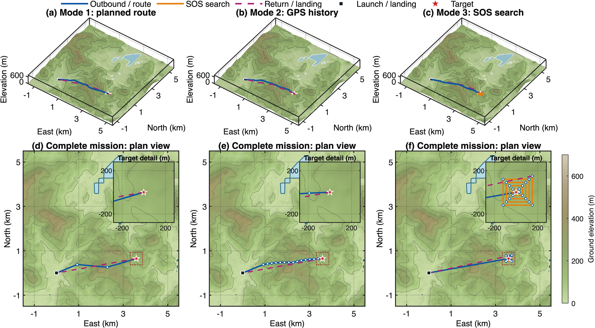
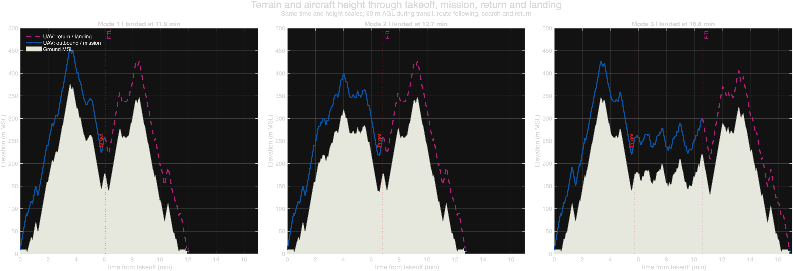
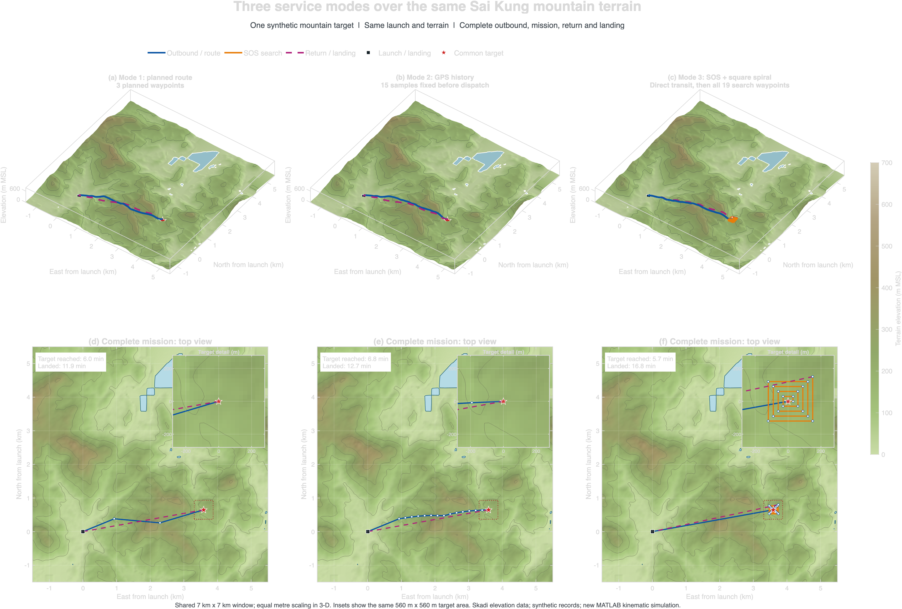

# Terrain Simulation

**Three search modes, one shared mountain scenario.** This MATLAB study compares complete Event Booking, Quick Start and SOS missions near Pak Tam Chung, Sai Kung. Each trajectory includes takeoff, search-route execution, return and landing over a common terrain model.

[System overview](../README.md) · [Mobile application](../code/mobile_application/README.md) · [Ground station](../code/ground_station/README.md) · [Search UAV](../code/search_uav/README.md)

**Tools:** MATLAB R2025b · Mapzen / Tilezen Skadi elevation · ffmpeg for replay rendering

## Mission view



[Full-resolution figure](paper_current/terrain_missions.png) · [Editable MATLAB figure](paper_current/terrain_missions.fig) · [Saved replay](output/Three_modes_complete_mission_replay.mp4)

The terrain figure uses saved trajectories. The route and GPS inputs are synthetic; the elevation tile supplies the terrain. Archived figures retain their original labels, while the current renderers use Event Booking, Quick Start and SOS.

## Simulation architecture


| Mode | Input to the simulated mission | Waypoints |
| --- | --- | --- |
| **Event Booking** | Ordered planned route | 3 |
| **Quick Start** | Timestamp-ordered GPS history available before dispatch | 15 |
| **SOS** | Centre plus expanding-square endpoints | 19 |

The three modes share the launch point and target. SOS completes its full search route before returning, even after the target is reached. The simulated clock begins at takeoff.

## Scenario and parameters

| Parameter | Saved value |
| --- | --- |
| Random seed | `20260926` |
| Launch location | 22.402° N, 114.322° E |
| Target location | 22.40782761° N, 114.35687745° E |
| Target ground elevation | Approximately 177.44 m |
| Terrain-following cruise | 80 m above ground |
| Horizontal / vertical speed limits | 15 m/s / 3 m/s |
| Waypoint hover | 5 s |
| SOS square spiral | Start at 30 m; increase by 30 m every two segments; stop at the first endpoint at least 200 m from the centre |

The source is the N22E114 Skadi tile: a 3601 × 3601 grid at 1 arc-second spacing with EGM96 elevations. Bilinear interpolation produces the 25 m plotting grid without increasing source resolution. Synthetic Quick Start sample times use a 1 m/s walking history; mobile booking estimates separately use 4 km/h.

## Saved results

| Mode | Target arrival | Landing complete |
| --- | ---: | ---: |
| Event Booking | 360.66 s | 715.65 s |
| Quick Start | 409.08 s | 764.07 s |
| SOS | 344.99 s | 1008.53 s |

These timings describe this fixed scenario. Different route geometry, record history or search extent changes mission duration. The table is a comparison of synthetic trajectories, not measured outdoor mission times.

<details>
<summary><strong>View altitude profiles and complete mission paths</strong></summary>





</details>

## Reproduce the study

Set the MATLAB current folder to this `simulation` directory. Choose the operation you need:

```matlab
% Redraw the paper figure from the saved study.
run_all('paper')

% Recompute trajectories into a new result directory.
run_all('simulate', fullfile(pwd, '..', 'local-results', 'simulation-01'))

% Render a replay of the saved trajectories; requires ffmpeg.
run_all('video', fullfile(pwd, '..', 'local-results', 'video-01'))
```

The default paper rendering writes to a new directory under `regenerated/`. Explicit result directories must be new. The existing `output/` folder remains the saved input/result archive.

## Files and results

| Material | Location |
| --- | --- |
| MATLAB entry point | [run_all.m](run_all.m) |
| Scenario generation and execution | [run_three_mode_simulation.m](run_three_mode_simulation.m) |
| Paper and mission renderers | [render_paper_terrain.m](render_paper_terrain.m) · [render_three_modes.m](render_three_modes.m) |
| Terrain source | [data/N22E114.hgt](data/N22E114.hgt) |
| Settings and mission timings | [scenario_and_settings.json](output/scenario_and_settings.json) · [mission_summary.csv](output/mission_summary.csv) |
| Saved workspace and GPS history | [three_mode_study.mat](output/three_mode_study.mat) · [synthetic_gps_history.csv](output/synthetic_gps_history.csv) |
| Per-mode input/output tables | `output/mode*_mission_waypoints.csv` · `output/mode*_execution_trace.csv` |

The 80 m terrain-following setting belongs to this study. Onboard ROS defaults and physical flight configuration are documented in the [UAV guide](../code/search_uav/README.md).
